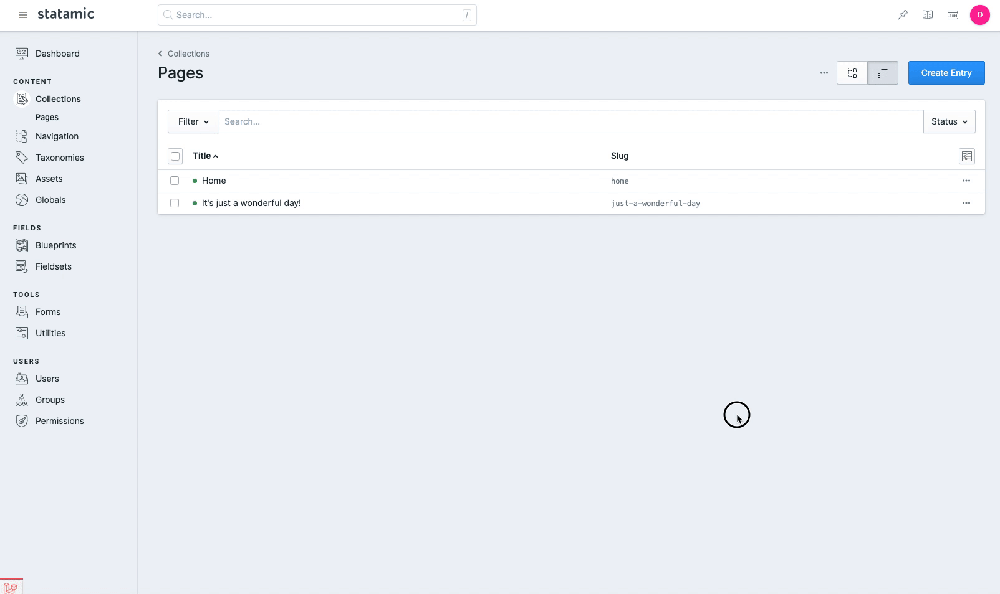

# Duplicator
> Duplicate Entries in Statamic 3

This addon makes it easy for content editors to duplicate existing entries from within the Statamic Control Panel.

## Installation

1. Install via Composer - `composer require doublethreedigital/duplicator`
2. Start duplicating!

## Usage

To duplicate an entry, go to the Collections page where you can view the entries, click on the three dots

1. Go to a Collection, and view the entries listing.
2. Decide on the entry you wish to duplicate. Click the three dots to toggle a dropdown and click the `Duplicate` option.

## Resources
* [Official Support](https://doublethree.digital)
* [Unofficial Support (#3rd-party)](https://statamic.com/discord)

